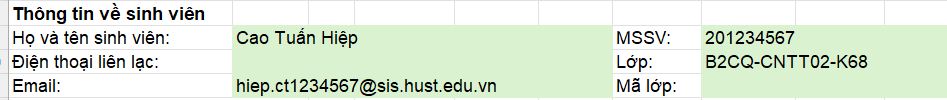
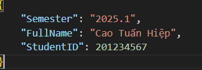

# THU THẬP DỮ LIỆU TRONG FILE MICRSOFT EXCEL

 ==> 

## Mục tiêu chương trình

Viêt chương trình python để lấy nội dung trong file excel và ghi ra file, với các tham số dòng lệnh.

- File xlsx theo định dạng .xlsx /.xls, chỉ định bởi tham số --document. Kiểm tra sự tồn tại của file này.
- Vị trí các cell cần đọc được mô tả trong file --json, định vị theo chỉ số cột-dòng dạng A3, B5, và đồng thời cho phép định vị theo Range Name.
- Chỉ định chính xác cả tên sheet, theo cấu trúc lồng "sheets": [{"Sheet 1", "cells": [ ]}]
- Các tham số dòng lệnh dài có tham số ngắn kèm theo.
- Thêm tham số dòng lệnh --verbose.

## Cấu trúc File Đặc tả JSON Bắt buộc

File JSON đặc tả của bạn phải tuân theo cấu trúc sau (ví dụ: [example.json](./example.json)):

```json
{
    "sheets": [
        {
            "name": "TrangBia",
            "cells": [
                { "name": "TenBaoCao", "location": "A1" },
                { "name": "NgayPhatHanh", "location": "NgayPhatHanh" }
            ]
        },
        {
            "name": "BaoCaoThongKe",
            "cells": [
                { "name": "TongSoDonHang", "location": "C10" }
            ]
        }
    ]
}
```

## Tham số dòng lệnh

Cú pháp:

```shell
python .\CollectDataFromExcel.py -h         
usage: CollectDataFromExcel.py [-h] --document DOCUMENT [--json JSON] [--verbose]

Chương trình xử lý file dữ liệu và đặc tả cấu trúc.

options:
  -h, --help            show this help message and exit
  --document, -d DOCUMENT
                        Tên file nguồn dữ liệu đầu vào. (Ví dụ: abc.xlsx)
  --json, -j JSON       Tên file JSON đặc tả cấu trúc.
                        Nếu không có, mặc định lấy theo tên file --document (Ví dụ: abc.json).
  --verbose, -v         Giải thích chi tiết từng bước hoạt động của chương trình.
```

Ví dụ:

```shell
python .\CollectDataFromExcel.py --document example.xlsx
python .\CollectDataFromExcel.py -d example.xlsx -j example.json -v
```
